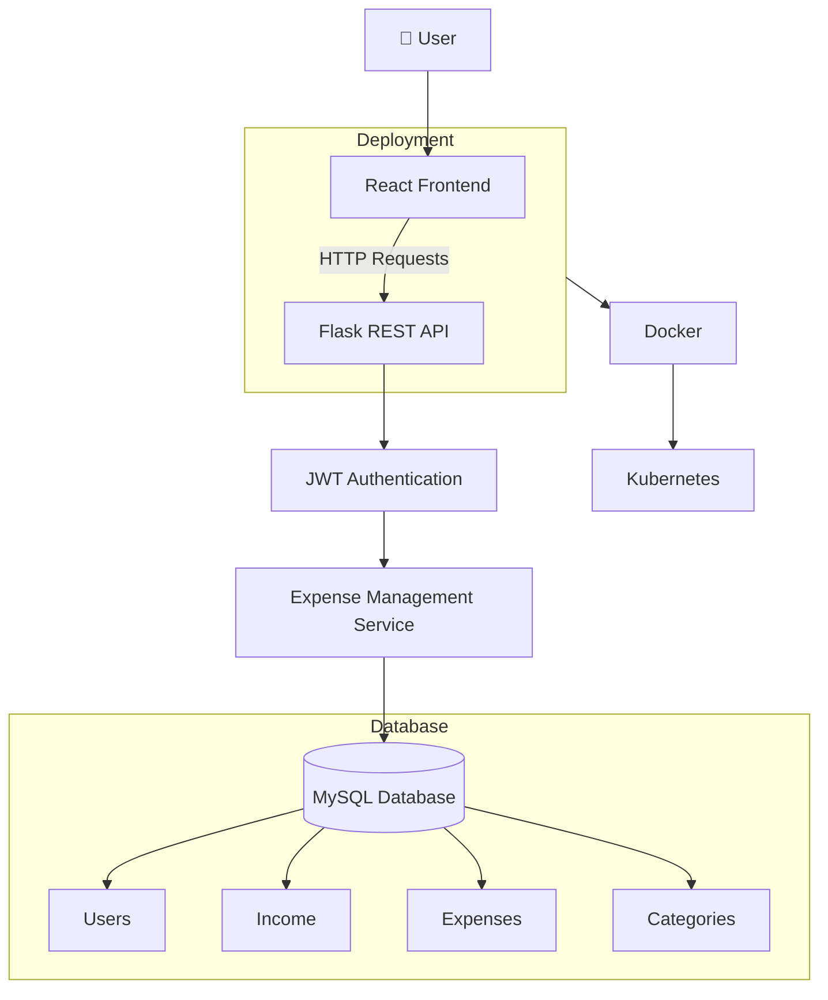

<div align="center">

# 💰 Expense Tracker

A full-stack expense management application built with React, Flask, MySQL, Docker, and Kubernetes to help users efficiently track income, expenses, and financial records.


</div>

---

📖 About

Expense Tracker is a full-stack web application that enables users to securely manage their personal finances by tracking income, expenses, and transaction history through an intuitive dashboard.

The application uses a React frontend and a Flask backend with MySQL as the database. It also includes Docker and Kubernetes configurations to demonstrate containerized deployment and orchestration.

-- 

📸 Application Preview
# Login


# Dashboard


# Add Expense


# Reports


---

✨ Features

- 🔐 User Authentication
- 💰 Income & Expense Management
- 📊 Dashboard Overview
- 📅 Transaction History
- 🗂 Category-wise Expense Tracking
- 🐳 Dockerized Deployment
- ☸ Kubernetes Deployment Configuration
- 💾 MySQL Database Integration

---

🏗 Architecture



---


🛠 Tech Stack

| Category | Technologies |
|-----------|--------------|
| Frontend | React.js, CSS, Axios |
| Backend | Flask (Python) |
| Database | MySQL |
| Containerization | Docker |
| Orchestration | Kubernetes |

---


📂 Project Structure

```text
Expense-Tracker
│
├── frontend/
├── backend/
├── kubernetes/
├── Dockerfile
├── docker-compose.yml
└── README.md
```

---

⚙ Getting Started

# Clone Repository

```bash
git clone https://github.com/Kushagrahms/expense-tracker.git
```

# Install Backend

```bash
cd backend

python -m venv venv

venv\Scripts\activate

pip install -r requirements.txt
```

# Run Backend

```bash
python run.py
```

# Install Frontend

```bash
cd frontend

npm install

npm run dev
```

# Docker

```bash
docker compose up --build
```

# Kubernetes

```bash
kubectl apply -f kubernetes/
```

---

📌 Future Improvements
- Export Reports (PDF/Excel)
- Email Notifications
- CI/CD Pipeline

---

👨‍💻 Author

**Kushagra Shrivastava**

If you found this project useful, feel free to ⭐ the repository.
